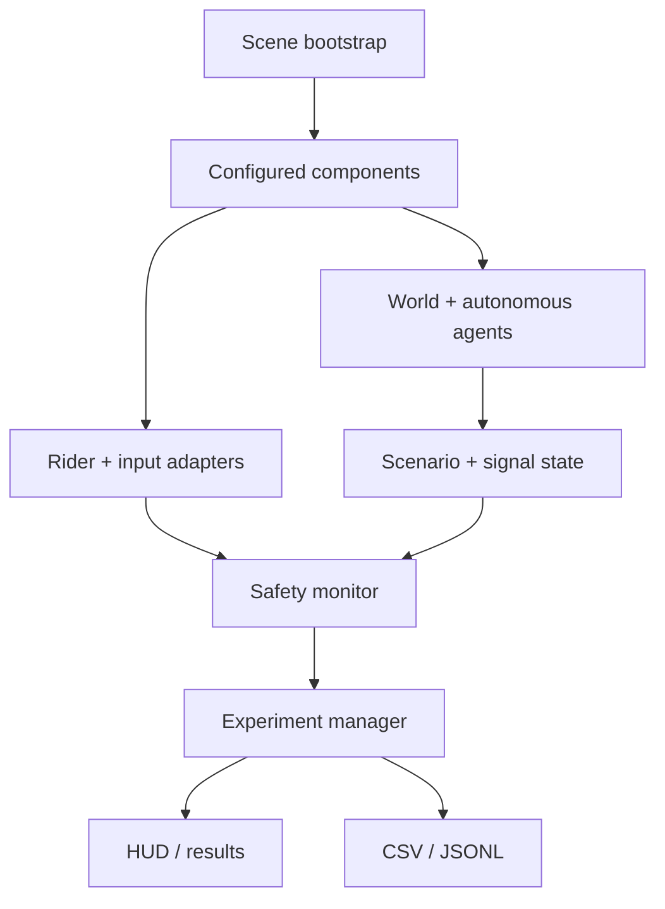

# Architecture

MobilityLab VR uses runtime composition: two tiny serialized scenes each contain
one bootstrap component, while focused runtime classes construct and wire the
self-contained experience. This avoids hand-authored YAML reference drift and
makes `Create or Rebuild Demo` safe to run repeatedly.

## Runtime data flow

## Responsibilities

| Area | Key classes | Responsibility |
| --- | --- | --- |
| Core | `SimulationSceneBootstrap`, `SessionContext`, `SimulationClock` | Composition, cross-scene anonymous choices, monotonic trial time |
| Input | `IPlayerInputSource`, `DesktopInputSource`, `CompositeInputSource` | Device-independent control frames |
| XR | `XRInputSource`, `XRHeadPoseDriver` | Optional controller and relative HMD pose without runtime dependency on a headset |
| Player | `ScooterController`, `DestinationZone` | Physics-based movement, view, contact reporting, completion |
| Traffic | `TrafficSignalStateMachine`, `TrafficSignalController`, `VehicleAgent` | Pure phase logic, coordinated state/events, waypoint traffic |
| Pedestrians | `PedestrianAgent` | Signal-aware crosswalk travel and procedural gait |
| Scenarios | `ScenarioDefinition`, `ScenarioManager`, `ScenarioTriggerZone` | Scriptable configuration, seed/reset, hazard activation, visibility |
| Safety | `NearMissClassifier`, `SafetyEventMonitor` | Pure relative-motion rule, duplicate suppression, counters, reaction time |
| Experiments | `ExperimentManager`, `ExperimentSummaryBuilder` | Trial lifecycle, pause/reset/timeout/completion, result construction |
| Telemetry | `TelemetryRecorder`, `CsvUtility` | Rate-limited samples, immediate events, summaries, safe persistence |
| UI | `MainMenuController`, `SimulationUIController`, `RuntimeUIFactory` | Programmatic, consistent, resolution-scaled interface |
| World | `CampusEnvironmentBuilder`, `AgentFactory` | Procedural geometry and deterministic agent construction |
| Editor | `ProjectSetup`, `BuildAutomation` | Idempotent assets/scenes/settings and development player builds |

## Dependency direction

- Input implementations depend on the small `IPlayerInputSource` contract;
  scooter physics does not know whether input came from desktop or XR.
- Agents query a signal controller and expose `IHazardTarget`; they do not write
  telemetry or results directly.
- The safety monitor consumes registered hazards and raises immutable event
  records. The telemetry recorder subscribes once.
- Experiment management owns trial lifecycle but delegates movement, signal,
  scenario, safety, and persistence concerns.
- Python consumes the documented CSV boundary and never runs inside Unity.

## Performance choices

- References are injected and cached during bootstrap.
- Agent obstacle detection uses a preallocated `SphereCastNonAlloc` buffer.
- Hazard evaluation runs at 10 Hz rather than every rendered frame.
- Telemetry defaults to 10 Hz, flushes in batches, and flushes events
  immediately.
- Materials are shared by color except signal lenses, whose emissive state is
  independently controlled.
- The environment uses primitives, simple colliders, one directional light,
  limited shadows, and no runtime texture/model loading.

These are design choices, not measured performance claims. Profile the target
student laptop before publishing frame-rate figures.

## Extending the project

To add a scenario, extend `ScenarioKind`, create a `ScenarioDefinition`, add the
activation behavior to `ScenarioManager`, register any new `IHazardTarget`, and
add deterministic reset plus tests. To add a new controller, implement
`IPlayerInputSource` and merge it through `CompositeInputSource`; scooter and
experiment code should not change.
