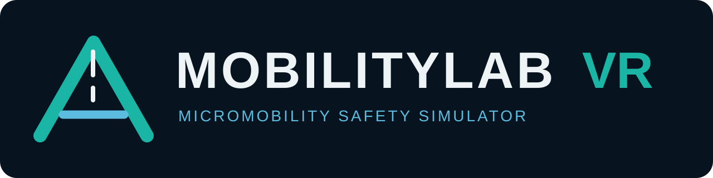
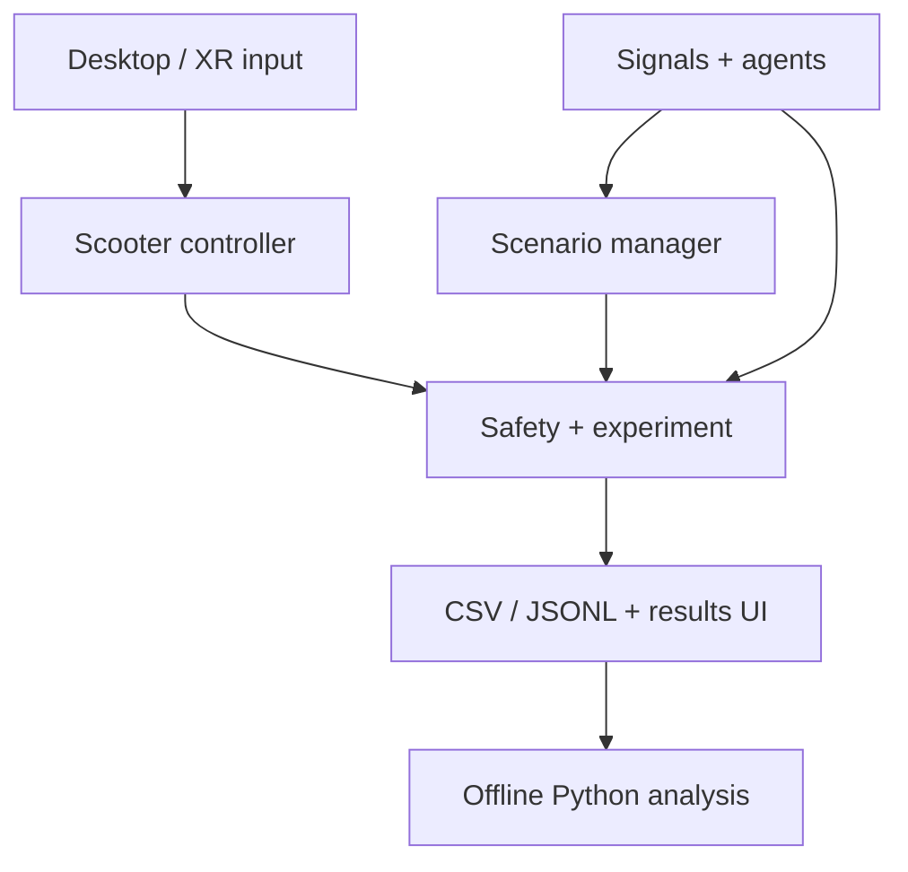

<p align="center">
  
</p>

# MobilityLab VR

**VR Micromobility Safety and Transportation Simulator**

MobilityLab VR is a self-contained Unity 3D portfolio research prototype for
repeatable electric-scooter safety experiments at a campus-style intersection.
It combines deterministic traffic scenarios, first-person desktop and optional
OpenXR input, explainable safety-event classification, structured telemetry,
and an offline Python analysis pipeline.

This is a software research prototype. It has **not** been scientifically
validated with human participants, and its demonstration safety score is not a
medical, diagnostic, or transportation-safety assessment.

## Highlights

- Desktop-first rigidbody scooter with acceleration, braking, steering,
  emergency braking, collisions, reset, mouse look, and a speed limit.
- OpenXR-ready controller and HMD adapters that do not alter core simulation
  logic or make a headset mandatory.
- Coordinated finite-state traffic signals with green, yellow, all-red, vehicle,
  and pedestrian phases.
- Low-poly vehicles with waypoint routing, signal compliance, forward obstacle
  checks, deterministic tuning, and scenario-specific failure-to-yield behavior.
- Procedural pedestrians with signal waits, crosswalk routes, simple gait
  animation, and controlled unexpected-entry behavior.
- Four selectable scenarios: Baseline, Sudden Pedestrian, Vehicle Fails to
  Yield, and Low Visibility.
- Collision, near-miss, excessive-speed, sudden-braking, completion, and timeout
  events with rate limiting and explainable near-miss evidence.
- Anonymous experiment sessions, 10 Hz configurable samples, RFC 4180-compatible
  CSV, JSONL event logs, safe file closing, and an in-application results screen.
- Python validation, scenario summaries, plots, and an interpretable offline
  logistic-regression workflow.
- Deterministic `Tools > MobilityLab VR > Create or Rebuild Demo` setup command,
  saved bootstrap scenes, Edit Mode tests, a Play Mode smoke test, and a desktop
  development-build command.

## Technology

| Area | Technology |
| --- | --- |
| Engine | Unity 6.3 LTS (`6000.3.0f1` baseline) |
| Rendering | Universal Render Pipeline 17.3; procedural low-poly geometry |
| Runtime | C#, Unity Physics, uGUI, Unity Input System |
| XR | XR Plug-in Management, OpenXR, Unity XR common usages |
| Testing | Unity Test Framework; Python `unittest` |
| Analysis | Python 3.10+, pandas, Matplotlib, scikit-learn, joblib |

No paid assets, external models, API keys, or runtime web services are used.
All visible geometry and the wordmark are generated from project-owned code and
primitives.

## Architecture



Core simulation behavior is independent of the input device. Managers receive
references during deterministic bootstrap; agents register with the safety
monitor once, avoiding scene-wide searches in frame loops. See
[Architecture.md](Documentation/Architecture.md) for component and data-flow
details.

## Open and run

1. Install **Unity Hub** and Unity **6.3 LTS**. The project baseline is
   `6000.3.0f1`; a newer stable 6.3 patch may prompt a normal project upgrade.
2. Clone or extract this repository.
3. In Unity Hub, select **Add > Add project from disk** and choose the repository
   root—the directory containing `Assets`, `Packages`, and `ProjectSettings`.
4. Let Unity resolve the packages in `Packages/manifest.json` and finish the
   first script import.
5. Run **Tools > MobilityLab VR > Create or Rebuild Demo**. This idempotently
   creates scenario assets, attempts to create and assign the URP renderer,
   rewrites both bootstrap scenes, and updates Build Settings.
6. Open `Assets/MobilityLabVR/Scenes/MainMenu.unity` and press **Play**.
7. Enter an anonymous ID such as `P001`, choose a scenario, and select
   **Start Experiment**.

The committed scenes already contain valid bootstrap objects, so step 5 is
recoverable setup rather than a requirement every time. Re-run it after a scene
is accidentally modified or when cloning onto a new Unity version.

## Desktop controls

| Input | Action |
| --- | --- |
| `W` / Up Arrow | Accelerate |
| `S` / Down Arrow | Brake; reverse after stopping |
| `A` `D` / Left Right | Steer |
| Mouse | Look around |
| Space | Emergency brake |
| `R` | Reset the current trial with the same deterministic seed |
| Escape | Pause or resume |

Ride north in the marked teal micromobility lane and pass through the teal
destination gate. The HUD shows speed, scenario, trial time, collisions, near
misses, and the rider-facing traffic signal.

## Experiment workflow

1. Use a non-identifying participant/session code. The menu rejects characters
   other than letters, digits, hyphens, and underscores and truncates at 32
   characters.
2. Select one of the four scenarios.
3. Start the trial and ride to the destination before the configured timeout.
4. Review completion time, minimum hazard distance, event counts, measurable
   reaction time, and the clearly labeled demonstration score.
5. Use the exact CSV path displayed on the results screen for offline analysis.

The files are placed under:

```text
Application.persistentDataPath/MobilityLabVR/Telemetry/
```

The precise operating-system path is shown in the results screen. See
[ExperimentalProcedure.md](Documentation/ExperimentalProcedure.md) before using
the prototype in a classroom or research demonstration.

## Scenarios

| Scenario | Controlled behavior | Difficulty |
| --- | --- | ---: |
| Baseline | Vehicles and pedestrians obey coordinated phases | 1/5 |
| Sudden Pedestrian | A visible pedestrian enters early after a south-approach trigger | 3/5 |
| Vehicle Fails to Yield | A turning vehicle crosses/merges into the rider path | 4/5 |
| Low Visibility | Normal traffic with reduced light and moderate exponential fog | 3/5 |

Scenario definitions are committed ScriptableObjects under
`Assets/MobilityLabVR/Resources/Scenarios`; built-in definitions provide a safe
fallback if those assets are unavailable. Seeds combine the anonymous ID,
scenario, and repetition, so reset behavior is repeatable. Detailed trigger and
design rationale are in [ScenarioDesign.md](Documentation/ScenarioDesign.md).

## Safety-event definitions

A near miss requires all of the following:

- relative motion is converging at least `0.75 m/s`;
- predicted surface-to-surface separation is at most `1.5 m`;
- time to closest approach is within `1.6 s`; and
- that hazard has not produced another near-miss record in the previous `4 s`.

Each record stores predicted separation, closing speed, time to closest
approach, hazard ID, and the thresholds used. These are transparent prototype
rules, not validated scientific cutoffs.

## Telemetry

The recorder writes three record types into one CSV:

- `sample`: state at a configurable frequency (10 Hz by default);
- `event`: immediate safety-event snapshot; and
- `summary`: final status, duration, counts, reaction time, and demo score.

Safety events are also written to a JSONL companion file. Writes use invariant
numeric formatting, correct CSV escaping, periodic flushing, event-time
flushing, and application-exit cleanup. The complete 27-column definition is in
[TelemetrySchema.md](Documentation/TelemetrySchema.md).

## Python analysis

The Unity application never depends on Python. To analyze exports:

```bash
cd Analysis
python3 -m venv .venv
source .venv/bin/activate                 # Windows: .venv\Scripts\activate
python -m pip install -r requirements.txt
python analyze_sessions.py "/path/to/Telemetry/*.telemetry.csv" --output output
```

The command validates required columns, skips malformed rows/files with clear
warnings, writes per-trial and per-scenario CSVs, and creates labeled PNG plots.

For the offline demonstration classifier:

```bash
python train_risk_model.py "/path/to/Telemetry/*.telemetry.csv" --output models --seed 42
```

The logistic-regression pipeline saves the model, metrics, limitations, and a
sorted coefficient table. It requires at least 12 trials and both label classes.
Do not claim a model trained on demonstration or synthetic data generalizes to
real riders.

No recorded trials yet? The explicitly synthetic workflow is documented in
[Analysis/README.md](Analysis/README.md).

## Testing and validation

### Python

```bash
python3 -m unittest discover -s Analysis/tests -v
```

Current authoring-environment result: **5 tests ran and passed**. These cover
schema loading, malformed values, aggregation, outcome-feature separation,
reproducible training, and saved artifacts.

### Unity Editor

Use **Window > General > Test Runner** and run both Edit Mode and Play Mode, or
run from a terminal. On macOS:

```bash
UNITY="/Applications/Unity/Hub/Editor/6000.3.0f1/Unity.app/Contents/MacOS/Unity"
"$UNITY" -batchmode -projectPath "$PWD" \
  -executeMethod MobilityLabVR.Editor.ProjectSetup.CreateOrRebuildDemo \
  -logFile Logs/setup.log -quit
"$UNITY" -batchmode -projectPath "$PWD" -runTests -testPlatform EditMode \
  -testResults Logs/editmode-results.xml -logFile Logs/editmode.log
"$UNITY" -batchmode -projectPath "$PWD" -runTests -testPlatform PlayMode \
  -testResults Logs/playmode-results.xml -logFile Logs/playmode.log
```

Build a desktop development player through **Tools > MobilityLab VR > Build
Development Player**, or with:

```bash
"$UNITY" -batchmode -projectPath "$PWD" \
  -executeMethod MobilityLabVR.Editor.BuildAutomation.PerformDevelopmentBuild \
  -logFile Logs/build.log -quit
```

Unity was not installed in the repository-authoring environment, so Unity
package resolution, C# compilation, Editor/Play Mode tests, screenshots, XR
hardware, and a player build remain explicitly unexecuted. See
[Verification.md](Documentation/Verification.md) for the exact verification
boundary and first-open checklist.

## VR / OpenXR

Desktop mode is always available. The project includes XR Plug-in Management,
OpenXR, controller input through XR common usages, and a relative HMD pose
driver. There is no camera bob or forced head rotation; the headset pose remains
relative to its trial-start orientation. A seated setup is recommended.

OpenXR provider/interaction-profile selections are platform settings and should
be confirmed once on the target machine. Optional XR Device Simulator setup and
the exact validation sequence are in [VRSetup.md](Documentation/VRSetup.md).

## Repository layout

```text
Assets/MobilityLabVR/
  Editor/             deterministic setup, validation, and build automation
  Input/              device-agnostic Input System action asset
  Scenes/             committed menu and simulation bootstrap scenes
  Scripts/            modular runtime systems by responsibility
  Tests/              Edit Mode logic tests and Play Mode scene smoke test
Analysis/              validation, statistics, plots, model training, tests
Documentation/         architecture, procedure, schema, scenarios, XR, demo
Packages/              Unity package manifest
ProjectSettings/       Unity project and build settings
Screenshots/           instructions for capturing genuine running-project media
```

## Visual media

No fabricated screenshots are included. The current environment could not run
Unity, so only the project-owned wordmark is shown above. After the Unity checks
pass, follow [DemoRecording.md](Documentation/DemoRecording.md) to capture real
screenshots and a 60–90 second video, then place the images under `Screenshots/`.

## Known limitations

- Unity import, compilation, physics tuning, rendering, tests, and player build
  have not been executed in this environment because no Unity Editor is present.
- OpenXR packages are declared but no headset or runtime was available for
  verification; platform-specific OpenXR features require target-machine setup.
- Vehicle/pedestrian behavior is intentionally understandable waypoint logic,
  not a calibrated traffic-flow or human-behavior model.
- The procedural environment prioritizes reproducibility and laptop performance
  over photorealism; no performance measurements are claimed yet.
- Reaction time is recorded only for designated scenario hazards and only when a
  post-trigger normal or emergency brake is observed.
- Near-miss thresholds and the safety score are transparent demonstration
  heuristics, not validated assessment instruments.
- Any real human-participant study requires institutional review, consent,
  privacy planning, accessibility review, and a preregistered analysis plan.

## Future research directions

- Counterbalanced scenario ordering and participant-level grouped analysis.
- Calibrated time-to-collision and post-encroachment-time measures.
- More realistic vehicle dynamics, route networks, and signal timing plans.
- Accessibility modes, alternative control devices, and cybersickness measures.
- Weather, auditory warnings, protected intersection geometry, and adaptive
  infrastructure studies.
- Repeated-measures models once an approved, sufficiently powered human study
  exists.

## Contributing, demo, and publishing

- Development and asset rules: [CONTRIBUTING.md](CONTRIBUTING.md)
- 60–90 second capture plan: [DemoRecording.md](Documentation/DemoRecording.md)
- Step-by-step public GitHub publication: [GitHubPublishing.md](Documentation/GitHubPublishing.md)
- Project changes: [CHANGELOG.md](CHANGELOG.md)

## Third-party assets and licenses

There are no third-party art, audio, fonts, models, or paid assets in the
repository. Unity packages are referenced by package name and remain subject to
their own Unity/package licenses. See
[ThirdPartyNotices.md](Documentation/ThirdPartyNotices.md).

Project source is released under the [MIT License](LICENSE).
